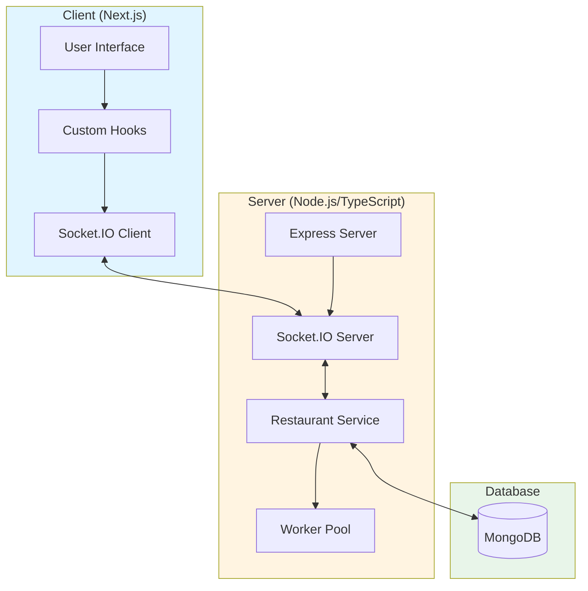
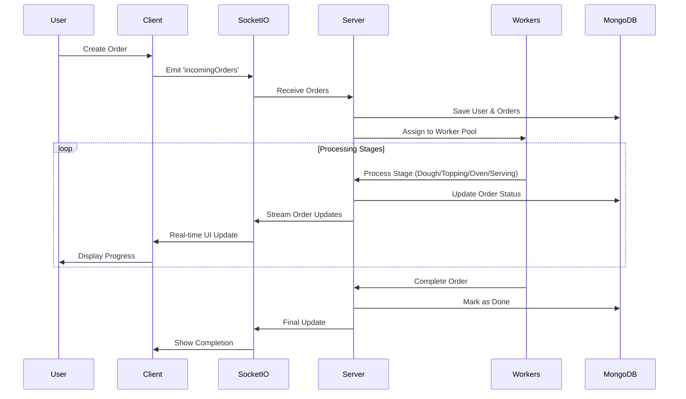

# Pizza Restaurant

A real-time pizza restaurant management system that simulates the complete pizza-making workflow from order placement to serving, with live updates and worker simulation.

Built in 2023. This full-stack application demonstrates a restaurant order processing system with multiple stages, worker management, real-time communication via Socket.IO, and a beautiful animated UI.

## Features

- 🍕 Interactive pizza ordering interface with size and topping selection
- 👨‍🍳 Worker simulation system (dough chefs, topping chefs, oven, waiters)
- 📊 Real-time order tracking through all processing stages
- 🔄 Live updates via Socket.IO bidirectional communication
- 💾 MongoDB database for persistent order and user storage
- 🎨 Beautiful UI with Tailwind CSS and Framer Motion animations
- ⏱️ Processing time tracking and statistics
- 👥 Automatic user generation with avatars and details
- 🎭 Stage-based workflow (Pending → Dough → Topping → Oven → Serving → Done)
- 🔀 Concurrent order processing with worker queue management

## Architecture



## Technology Stack

### Server
- **Node.js** - Runtime environment
- **TypeScript** - Type-safe language
- **Express** - Web framework
- **MongoDB** - NoSQL database
- **Mongoose** - MongoDB ODM
- **Socket.IO** - Real-time bidirectional communication
- **Winston** - Logging library
- **chance** - Random data generation for workers

### Client
- **Next.js** - React framework
- **React** - UI library
- **Custom Hooks** - State management (usePizzaOrder, usePizzaRestaurant)
- **Tailwind CSS** - Utility-first CSS framework
- **Socket.IO Client** - Real-time communication
- **@headlessui/react** - Accessible UI components
- **Framer Motion** - Animation library
- **FontAwesome** - Icon library
- **chance** - Random user generation
- **Sass** - CSS preprocessor
- **Yup** - Schema validation

## System Flow



## Processing Stages

| Stage | Workers | Time | Description |
|-------|---------|------|-------------|
| **Pending** | - | - | Order waiting to be processed |
| **Dough** | 2 Dough Chefs | 7s | Preparing pizza dough base |
| **Topping** | 3 Topping Chefs | 4s per 2 toppings | Adding toppings (parallel processing) |
| **Oven** | 1 Oven | 10s | Baking the pizza |
| **Serving** | 2 Waiters | 5s | Preparing for delivery |
| **Done** | - | - | Order completed |

## Getting Started

### Prerequisites

- **Node.js** (v18 or higher)
- **npm** (comes with Node.js)
- **MongoDB** installed and running locally

### Installation

1. Clone the repository:
```bash
git clone https://github.com/orassayag/pizza-restaurant.git
cd pizza-restaurant
```

2. Install server dependencies:
```bash
cd server
npm install
```

3. Install client dependencies:
```bash
cd ../client
npm install
```

### Running the Application

1. **Start MongoDB**:
```bash
mongod
# Or with Docker: docker run -d -p 27017:27017 --name mongodb mongo
```

2. **Start the server** (in `server/` directory):
```bash
npm run dev
```
Wait for:
- MongoDB connection
- Socket.IO initialization
- Server ready message

3. **Start the client** (in `client/` directory):
```bash
npm run dev
```
The application will open automatically at http://localhost:3000

### Usage

1. Click the **"Order"** button (red button in top-right)
2. Select pizza size (Small/Medium/Large)
3. Choose toppings with segmentation (Full/Left Half/Right Half)
4. Click **"Add to Cart"** to add pizza
5. Repeat for multiple pizzas
6. Click **"Checkout"** to submit orders
7. Watch the real-time processing in the dashboard!

## Project Structure

```
pizza-restaurant/
├── server/
│   ├── src/
│   │   ├── app.ts              # Application entry point
│   │   ├── services/           # Business logic services
│   │   │   └── restaurant.service.ts
│   │   ├── providers/          # Infrastructure providers
│   │   │   ├── mongodb.provider.ts
│   │   │   ├── socketio.provider.ts
│   │   │   └── logger.provider.ts
│   │   ├── bl/                 # Business layer
│   │   │   ├── models/         # Business models
│   │   │   └── enums/          # Enumerations
│   │   ├── models/             # Local models
│   │   ├── utils/              # Utility functions
│   │   ├── helpers/            # Helper functions
│   │   ├── config/             # Configuration
│   │   └── custom/             # Custom classes (errors)
│   ├── config/                 # Configuration files
│   └── package.json
├── client/
│   ├── src/
│   │   ├── pages/              # Next.js pages
│   │   ├── components/
│   │   │   ├── pages/          # Page components
│   │   │   └── common/         # Reusable components
│   │   ├── hooks/              # Custom React hooks
│   │   ├── models/             # Data models
│   │   ├── providers/          # Providers (Socket.IO, Random)
│   │   ├── config/             # Configuration
│   │   └── styles/             # Global styles
│   └── package.json
├── README.md
├── CONTRIBUTING.md
├── INSTRUCTIONS.md
└── LICENSE
```

## Available Scripts

### Server
```bash
npm run dev          # Development mode with auto-reload
npm run start        # Production build and start
npm run lint         # Check code quality
npm run prettier-fix # Format code
```

### Client
```bash
npm run dev          # Development mode (auto-opens browser)
npm run build        # Production build
npm run start        # Start production server
npm run lint         # Check code quality
```

## Key Features Explained

### Worker Pool Management
The server maintains a pool of workers for each stage. When an order arrives, the system assigns available workers. If all workers are busy, orders wait in queue until a worker becomes available.

### Topping Stage Optimization
The topping stage uses parallel processing - multiple topping chefs can work on the same pizza simultaneously, each handling 2 toppings at a time.

### Real-time Updates
Socket.IO streams order status updates every 500ms, ensuring the UI reflects the current state of all orders in real-time.

### Automatic User Generation
Each order is associated with a randomly generated user (using the `chance` library) with realistic names, gender, and avatar images.

## Troubleshooting

### MongoDB Connection Failed
- Ensure MongoDB is running: `mongod`
- Check connection URL in `server/config/env.json`

### Socket.IO Connection Failed
- Ensure server is running on port 5000
- Check Socket.IO URL in client configuration

### Orders Not Appearing
- Refresh the browser
- Restart server and client
- Clear MongoDB database if needed

See [INSTRUCTIONS.md](INSTRUCTIONS.md) for detailed troubleshooting.

## Contributing

Contributions are welcome! Please read [CONTRIBUTING.md](CONTRIBUTING.md) for details on our code of conduct and the process for submitting pull requests.

## Development

The project uses:
- **TypeScript** for server type safety
- **ESLint** for code linting
- **Prettier** for code formatting
- **Nodemon** for server auto-reload
- **Next.js hot reload** for client development

## Notes

- Pizza images are CSS sprites (educational purposes only)
- Worker names and user data are randomly generated
- Processing times are simulated with delays
- The system can handle concurrent orders based on worker availability

## Future Enhancements

- User authentication and order history
- Payment integration
- Real-time notifications
- Admin dashboard for worker management
- Order cancellation feature
- Custom pizza builder with price calculation
- Delivery tracking
- Multiple restaurant locations

## Author

* **Or Assayag** - *Initial work* - [orassayag](https://github.com/orassayag)
* Or Assayag <orassayag@gmail.com>
* GitHub: https://github.com/orassayag
* StackOverflow: https://stackoverflow.com/users/4442606/or-assayag?tab=profile
* LinkedIn: https://linkedin.com/in/orassayag

## License

This application has an MIT license - see the [LICENSE](LICENSE) file for details.
