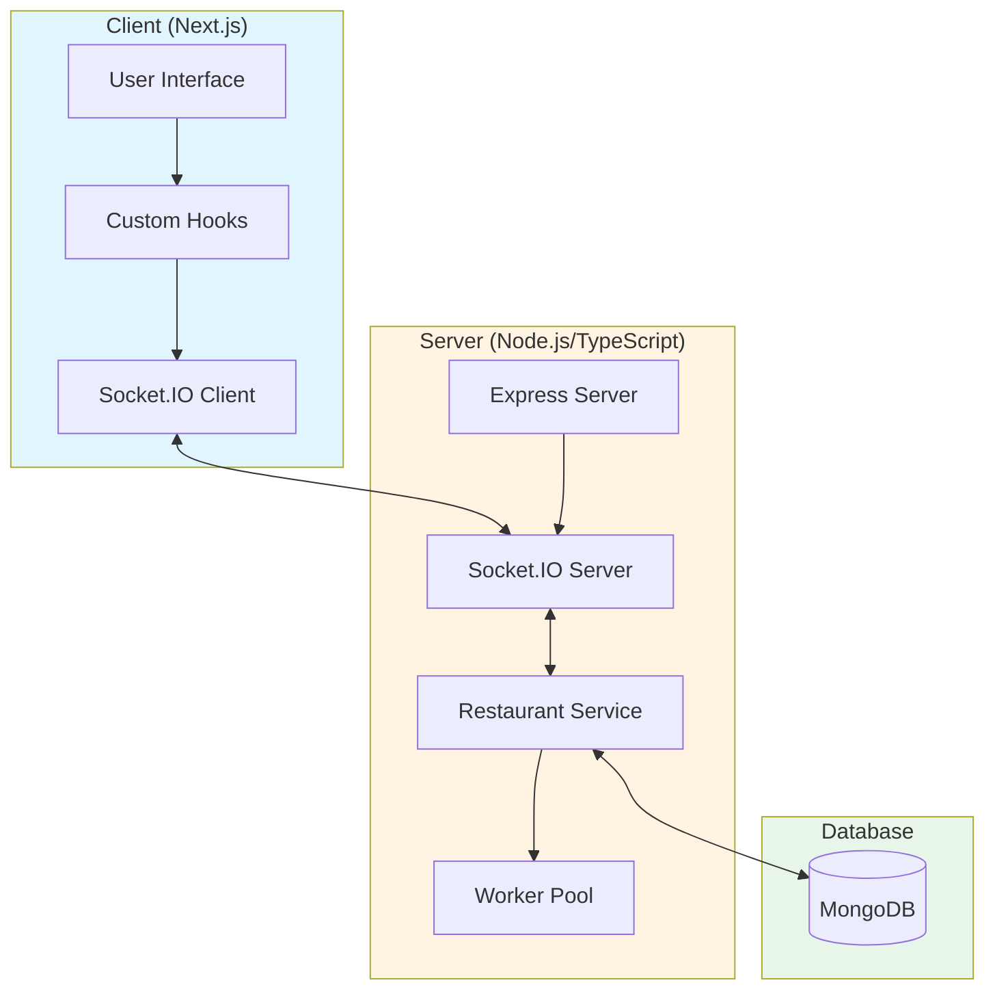
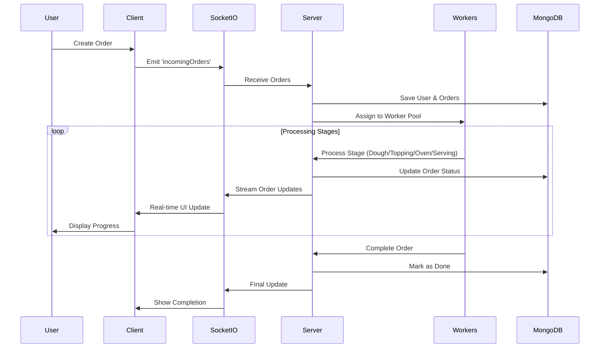

# Pizza Restaurant

A real-time restaurant management system that simulates a complete multi-stage pizza production workflow.

Built in 2023, this full-stack application orchestrates concurrent worker queues—handling dough preparation, custom toppings, baking, and serving. It uses Node.js and TypeScript to manage backend services, while Socket.IO pushes live, bidirectional state changes to a Next.js frontend. The responsive dashboard features smooth Framer Motion animations, automated customer profiles, and a persistent MongoDB database layer.

## Features

- 🍕 Interactive pizza ordering interface with size and topping selection
- 👨‍🍳 Worker simulation system (dough chefs, topping chefs, oven, waiters)
- 📊 Real-time order tracking through all processing stages
- 🔄 Live updates via Socket.IO bidirectional communication
- 💾 MongoDB database for persistent order and user storage
- 🎨 Beautiful UI with Tailwind CSS and Framer Motion animations
- ⏱️ Processing time tracking and statistics
- 👥 Automatic user generation with avatars and details
- 🎭 Stage-based workflow (Pending → Dough → Topping → Oven → Serving → Done)
- 🔀 Concurrent order processing with worker queue management

### Core Capabilities

- **Real-time Order Processing**: Live updates for order stages and worker assignments
- **Worker Pool Management**: Concurrent processing with dedicated workers per stage
- **Interactive Ordering**: Custom pizza builder with size and topping options
- **Automatic User Generation**: Realistic user profiles with avatars
- **Persistent Storage**: MongoDB for storing orders and users

### Technical Excellence

- **TypeScript**: Strict type safety for server-side code
- **Real-time Communication**: Socket.IO for bidirectional updates
- **Modern UI**: Next.js with Tailwind CSS and Framer Motion animations
- **Database Integration**: MongoDB with Mongoose ODM
- **Logging**: Winston for structured logging

### Developer Experience

- **Hot Reload**: Nodemon for server and Next.js hot reload for client
- **Type Safety**: TypeScript for better developer experience
- **Code Quality**: ESLint and Prettier configured
- **Clear Architecture**: Separation of concerns between client, server, and database

## Architecture


```mermaid
graph TB
    subgraph Client["Client (Next.js)"]
        UI[User Interface]
        Hooks[Custom Hooks]
        SocketClient[Socket.IO Client]
    end

    subgraph Server["Server (Node.js/TypeScript)"]
        Express[Express Server]
        SocketServer[Socket.IO Server]
        RestaurantService[Restaurant Service]
        Workers[Worker Pool]
    end

    subgraph Database["Database"]
        MongoDB[(MongoDB)]
    end

    UI --> Hooks
    Hooks --> SocketClient
    SocketClient <--> SocketServer
    SocketServer <--> RestaurantService
    RestaurantService --> Workers
    RestaurantService <--> MongoDB
    Express --> SocketServer

    style Client fill:#e1f5ff
    style Server fill:#fff4e1
    style Database fill:#e8f5e9
```

## Technology Stack

### Server

- **Node.js** - Runtime environment
- **TypeScript** - Type-safe language
- **Express** - Web framework
- **MongoDB** - NoSQL database
- **Mongoose** - MongoDB ODM
- **Socket.IO** - Real-time bidirectional communication
- **Winston** - Logging library
- **chance** - Random data generation for workers

### Client

- **Next.js** - React framework
- **React** - UI library
- **Custom Hooks** - State management (usePizzaOrder, usePizzaRestaurant)
- **Tailwind CSS** - Utility-first CSS framework
- **Socket.IO Client** - Real-time communication
- **@headlessui/react** - Accessible UI components
- **Framer Motion** - Animation library
- **FontAwesome** - Icon library
- **chance** - Random user generation
- **Sass** - CSS preprocessor
- **Yup** - Schema validation

## System Flow


```mermaid
sequenceDiagram
    participant User
    participant Client
    participant SocketIO
    participant Server
    participant Workers
    participant MongoDB

    User->>Client: Create Order
    Client->>SocketIO: Emit 'incomingOrders'
    SocketIO->>Server: Receive Orders
    Server->>MongoDB: Save User & Orders
    Server->>Workers: Assign to Worker Pool

    loop Processing Stages
        Workers->>Server: Process Stage (Dough/Topping/Oven/Serving)
        Server->>MongoDB: Update Order Status
        Server->>SocketIO: Stream Order Updates
        SocketIO->>Client: Real-time UI Update
        Client->>User: Display Progress
    end

    Workers->>Server: Complete Order
    Server->>MongoDB: Mark as Done
    Server->>SocketIO: Final Update
    SocketIO->>Client: Show Completion
```

## Processing Stages

| Stage       | Workers         | Time              | Description                           |
| ----------- | --------------- | ----------------- | ------------------------------------- |
| **Pending** | -               | -                 | Order waiting to be processed         |
| **Dough**   | 2 Dough Chefs   | 7s                | Preparing pizza dough base            |
| **Topping** | 3 Topping Chefs | 4s per 2 toppings | Adding toppings (parallel processing) |
| **Oven**    | 1 Oven          | 10s               | Baking the pizza                      |
| **Serving** | 2 Waiters       | 5s                | Preparing for delivery                |
| **Done**    | -               | -                 | Order completed                       |

## Getting Started

### Prerequisites

- **Node.js** (v18 or higher)
- **npm** (comes with Node.js)
- **MongoDB** installed and running locally

### Installation

1. Clone the repository:

```bash
git clone https://github.com/orassayag/pizza-restaurant.git
cd pizza-restaurant
```

2. Install server dependencies:

```bash
cd server
npm install
```

3. Install client dependencies:

```bash
cd ../client
npm install
```

### Running the Application

1. **Start MongoDB**:

```bash
mongod
# Or with Docker: docker run -d -p 27017:27017 --name mongodb mongo
```

2. **Start the server** (in `server/` directory):

```bash
npm run dev
```

Wait for:

- MongoDB connection
- Socket.IO initialization
- Server ready message

3. **Start the client** (in `client/` directory):

```bash
npm run dev
```

The application will open automatically at http://localhost:3000

### Usage

1. Click the **"Order"** button (red button in top-right)
2. Select pizza size (Small/Medium/Large)
3. Choose toppings with segmentation (Full/Left Half/Right Half)
4. Click **"Add to Cart"** to add pizza
5. Repeat for multiple pizzas
6. Click **"Checkout"** to submit orders
7. Watch the real-time processing in the dashboard!

## Available Scripts

### Server Scripts

```bash
npm run dev          # Development mode with auto-reload
npm run start        # Production build and start
npm run lint         # Check code quality
npm run prettier-fix # Format code
```

### Client Scripts

```bash
npm run dev          # Development mode (auto-opens browser)
npm run build        # Production build
npm run start        # Start production server
npm run lint         # Check code quality
```

## Architecture Principles

This project follows clean architecture principles:

1. **Separation of Concerns**: Client, server, and database are clearly separated
2. **Real-time Communication**: Socket.IO for bidirectional updates
3. **Type Safety**: TypeScript on the server for better reliability
4. **Domain Organization**: Code organized by business logic
5. **Testability**: Modular design for easier testing
6. **Error Handling**: Custom error classes and logging

## Directory Structure

```
pizza-restaurant/
├── server/
│   ├── src/
│   │   ├── app.ts              # Application entry point
│   │   ├── services/           # Business logic services
│   │   │   └── restaurant.service.ts
│   │   ├── providers/          # Infrastructure providers
│   │   │   ├── mongodb.provider.ts
│   │   │   ├── socketio.provider.ts
│   │   │   └── logger.provider.ts
│   │   ├── bl/                 # Business layer
│   │   │   ├── models/         # Business models
│   │   │   └── enums/          # Enumerations
│   │   ├── models/             # Local models
│   │   ├── utils/              # Utility functions
│   │   ├── helpers/            # Helper functions
│   │   ├── config/             # Configuration
│   │   └── custom/             # Custom classes (errors)
│   ├── config/                 # Configuration files
│   └── package.json
├── client/
│   ├── src/
│   │   ├── pages/              # Next.js pages
│   │   ├── components/
│   │   │   ├── pages/          # Page components
│   │   │   └── common/         # Reusable components
│   │   ├── hooks/              # Custom React hooks
│   │   ├── models/             # Data models
│   │   ├── providers/          # Providers (Socket.IO, Random)
│   │   ├── config/             # Configuration
│   │   └── styles/             # Global styles
│   └── package.json
├── README.md
├── CONTRIBUTING.md
├── INSTRUCTIONS.md
└── LICENSE
```

## Design Patterns

- **Observer Pattern**: Socket.IO for real-time updates
- **Repository Pattern**: MongoDB access via Mongoose
- **Factory Pattern**: Worker creation
- **Singleton Pattern**: Socket.IO server instance

## Project Structure

```
pizza-restaurant/
├── server/
│   ├── src/
│   │   ├── app.ts              # Application entry point
│   │   ├── services/           # Business logic services
│   │   │   └── restaurant.service.ts
│   │   ├── providers/          # Infrastructure providers
│   │   │   ├── mongodb.provider.ts
│   │   │   ├── socketio.provider.ts
│   │   │   └── logger.provider.ts
│   │   ├── bl/                 # Business layer
│   │   │   ├── models/         # Business models
│   │   │   └── enums/          # Enumerations
│   │   ├── models/             # Local models
│   │   ├── utils/              # Utility functions
│   │   ├── helpers/            # Helper functions
│   │   ├── config/             # Configuration
│   │   └── custom/             # Custom classes (errors)
│   ├── config/                 # Configuration files
│   └── package.json
├── client/
│   ├── src/
│   │   ├── pages/              # Next.js pages
│   │   ├── components/
│   │   │   ├── pages/          # Page components
│   │   │   └── common/         # Reusable components
│   │   ├── hooks/              # Custom React hooks
│   │   ├── models/             # Data models
│   │   ├── providers/          # Providers (Socket.IO, Random)
│   │   ├── config/             # Configuration
│   │   └── styles/             # Global styles
│   └── package.json
├── README.md
├── CONTRIBUTING.md
├── INSTRUCTIONS.md
└── LICENSE
```

## Key Features Explained

### Worker Pool Management

The server maintains a pool of workers for each stage. When an order arrives, the system assigns available workers. If all workers are busy, orders wait in queue until a worker becomes available.

### Topping Stage Optimization

The topping stage uses parallel processing - multiple topping chefs can work on the same pizza simultaneously, each handling 2 toppings at a time.

### Real-time Updates

Socket.IO streams order status updates every 500ms, ensuring the UI reflects the current state of all orders in real-time.

### Automatic User Generation

Each order is associated with a randomly generated user (using the `chance` library) with realistic names, gender, and avatar images.

## Best Practices

### Before Development

1. **Start with MongoDB**: Ensure MongoDB is running before starting the server
2. **Install Dependencies**: Run npm install in both server and client directories
3. **Check Configuration**: Verify connection URLs in config files

### Code Quality

1. **Follow TypeScript**: Use TypeScript on the server for type safety
2. **Lint Code**: Run npm run lint before committing
3. **Format Code**: Use Prettier for consistent formatting

### Development Workflow

1. **Use Hot Reload**: Both server and client support hot reload for faster development
2. **Monitor Logs**: Check server logs for worker assignments and errors
3. **Test Features**: Test the full ordering flow regularly

## Troubleshooting

### MongoDB Connection Failed

- Ensure MongoDB is running: `mongod`
- Check connection URL in `server/config/env.json`

### Socket.IO Connection Failed

- Ensure server is running on port 5000
- Check Socket.IO URL in client configuration

### Orders Not Appearing

- Refresh the browser
- Restart server and client
- Clear MongoDB database if needed

See [INSTRUCTIONS.md](INSTRUCTIONS.md) for detailed troubleshooting.

## Contributing

Contributions are welcome! Please read [CONTRIBUTING.md](CONTRIBUTING.md) for details on our code of conduct and the process for submitting pull requests.

## Development

The project uses:

- **TypeScript** for server type safety
- **ESLint** for code linting
- **Prettier** for code formatting
- **Nodemon** for server auto-reload
- **Next.js hot reload** for client development

## Support

For questions, issues, or contributions:

- **GitHub Issues**: [https://github.com/orassayag/pizza-restaurant/issues](https://github.com/orassayag/pizza-restaurant/issues)
- **Email**: orassayag@gmail.com

## Notes

- Pizza images are CSS sprites (educational purposes only)
- Worker names and user data are randomly generated
- Processing times are simulated with delays
- The system can handle concurrent orders based on worker availability

## Future Enhancements

- User authentication and order history
- Payment integration
- Real-time notifications
- Admin dashboard for worker management
- Order cancellation feature
- Custom pizza builder with price calculation
- Delivery tracking
- Multiple restaurant locations

## Author

- **Or Assayag** - _Initial work_ - [orassayag](https://github.com/orassayag)
- Or Assayag <orassayag@gmail.com>
- GitHub: https://github.com/orassayag
- StackOverflow: https://stackoverflow.com/users/4442606/or-assayag?tab=profile
- LinkedIn: https://linkedin.com/in/orassayag

## License

This application has an MIT license - see the [LICENSE](LICENSE) file for details.

## Acknowledgments

- Built for educational and research purposes
- Respects robots.txt and implements rate limiting
- Uses user-agent rotation to avoid detection
- Implements polite crawling practices
